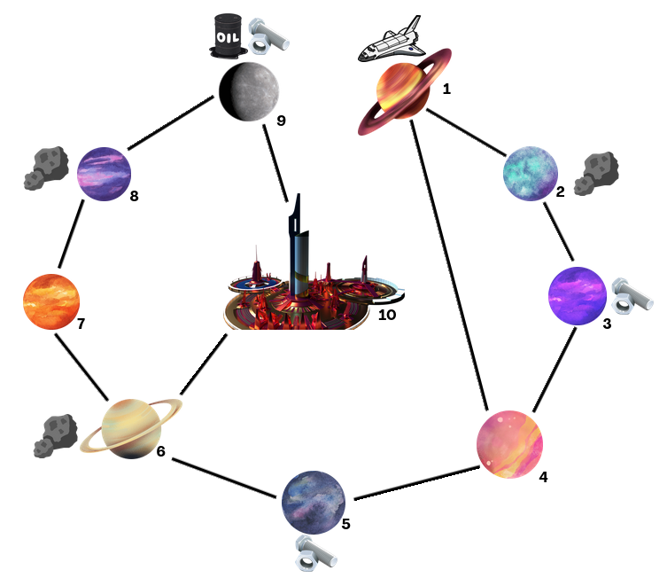

# Project Overview

This project focuses on solving a complex optimization problem in the context of a spaceship navigating a universe of planets to collect parts, manage fuel, and craft a jet booster. The problem is formulated using the Planning Domain Definition Language (PDDL), a symbolic AI tool for automated planning. The goal is to find an optimal sequence of actions for the spaceship to collect parts, refuel, and craft the jet booster while adhering to constraints such as fuel management, resource collection, and navigation.



### Problem Description

The spaceship operates in a universe of 10 planets, connected by wormholes. The objective is to collect three parts from different planets, transport them to the central space station (planet 10), and craft a jet booster. Key constraints include:
- Fuel Management: The spaceship must refuel at planets with fuel stations.
- Resource Collection: Resources can be mined to build fuel stations if no fuel is available.
- Crafting: The jet booster can only be crafted once all three parts are delivered to the central space station.
- Navigation: The spaceship can only travel between planets connected by wormholes.


### Results

The PDDL solver successfully generated optimal plans for various scenarios:
- Base Scenario: The solver found the optimal sequence of actions in approximately 6.13 seconds.
- Resource Scarcity Scenario: When resources were removed from certain planets, the solver adapted by using alternative resources and still found a solution in 1.13 seconds.
- Impossible Scenarios: In cases where no solution was possible (e.g., insufficient resources), the solver correctly identified the problem and returned a "No plan was found" message.

Example Plan:
```bash
    travel spaceship1 planet1 planet2
    mine-resources spaceship1 planet2 resource1
    travel spaceship1 planet2 planet3
    pick-up spaceship1 part1 planet3
    build-fuel-station spaceship1 planet3 resource1
    refuel spaceship1 planet3
    travel spaceship1 planet3 planet4
    travel spaceship1 planet4 planet5
    travel spaceship1 planet5 planet6
    travel spaceship1 planet6 planet10
    drop-off spaceship1 part1 planet10
    travel spaceship1 planet10 planet6
    mine-resources spaceship1 planet6 resource2
    travel spaceship1 planet6 planet5
    pick-up spaceship1 part2 planet5
    build-fuel-station spaceship1 planet5 resource2
    refuel spaceship1 planet5
    travel spaceship1 planet5 planet6
    travel spaceship1 planet6 planet10
    drop-off spaceship1 part2 planet10
    travel spaceship1 planet10 planet9
    pick-up spaceship1 part3 planet9
    refuel spaceship1 planet9
    travel spaceship1 planet9 planet10
    drop-off spaceship1 part3 planet10
    craft-jet-booster spaceship1 planet10
```